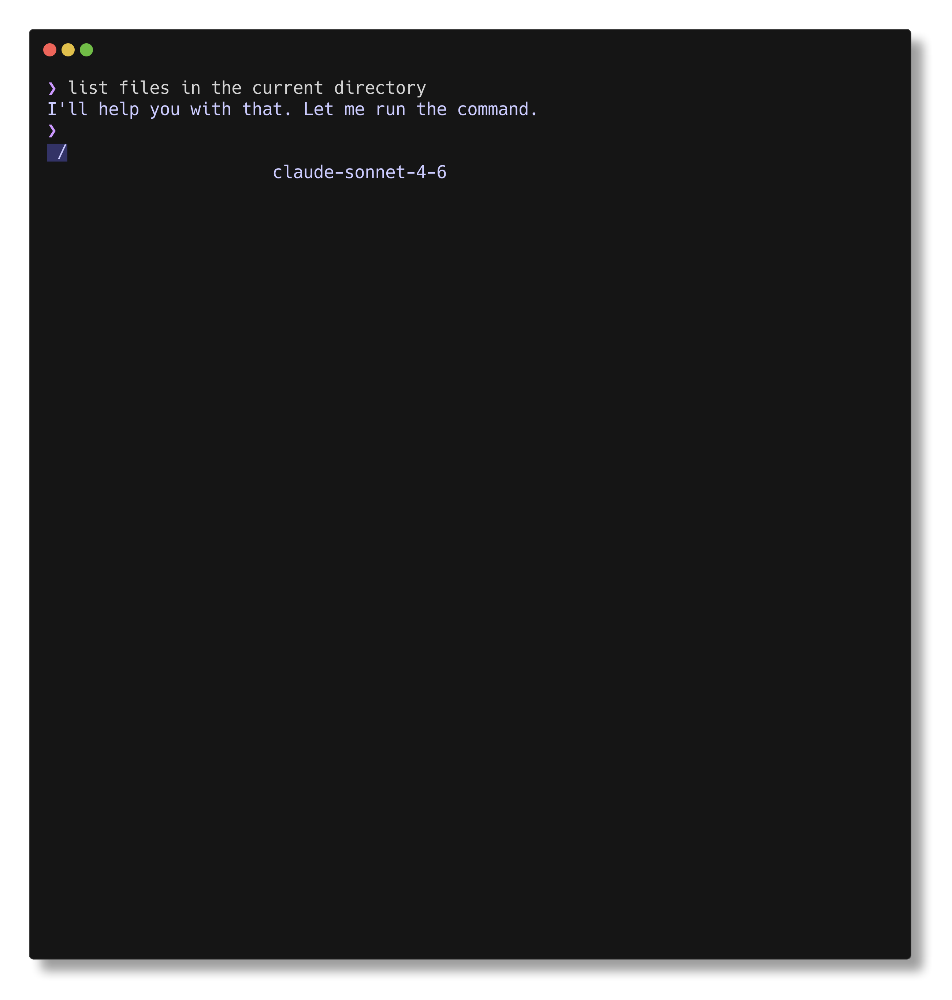

# nsh

A natural language shell. Type what you want; nsh runs the right commands.



## Install

Download a binary from [Releases](https://github.com/InfJoker/nsh/releases):

```bash
# macOS (Apple Silicon)
curl -L https://github.com/InfJoker/nsh/releases/latest/download/nsh-darwin-arm64 -o nsh

# macOS (Intel)
curl -L https://github.com/InfJoker/nsh/releases/latest/download/nsh-darwin-amd64 -o nsh

# Linux (x86_64)
curl -L https://github.com/InfJoker/nsh/releases/latest/download/nsh-linux-amd64 -o nsh

# Linux (ARM64)
curl -L https://github.com/InfJoker/nsh/releases/latest/download/nsh-linux-arm64 -o nsh
```

Then make it executable and move it to your PATH:

```bash
chmod +x nsh && sudo mv nsh /usr/local/bin/
```

Or build from source:

```bash
git clone https://github.com/InfJoker/nsh.git
cd nsh
go build -o nsh ./cmd/nsh
```

## Quick start

```bash
export ANTHROPIC_API_KEY="sk-ant-..."
nsh
```

On first run, nsh detects available providers and guides you through setup. Configuration lives in `~/.nsh/config.toml`.

## Usage

Type plain English at the `>` prompt:

```
> show me disk usage sorted by size
> find all TODO comments in this project
> compress the logs directory into a tarball
```

### Raw commands

Prefix with `!` to skip the LLM and execute directly, with full terminal passthrough:

```
> !vim server.go
> !htop
> !git rebase -i HEAD~3
```

### Non-interactive mode

Run a single query from scripts or your existing shell:

```bash
nsh --exec "show me open ports"
nsh --exec "what's using the most memory" --preset cloud
```

### Builtins

| Command | Action |
|---|---|
| `cd [dir]` | Change directory |
| `export KEY=VALUE` | Set environment variable |
| `unset KEY` | Remove environment variable |
| `alias name=value` | Create alias |
| `presets` | Switch model preset |
| `provider` | Switch LLM provider |

## Providers

nsh supports several LLM backends:

| Provider | Requirements |
|---|---|
| `anthropic` | `ANTHROPIC_API_KEY` env var |
| `ollama` | Ollama running locally with a pulled model |
| `llama.cpp` | HuggingFace GGUF repo (auto-downloads) |
| `mlx` | Apple Silicon + `pip3 install mlx-lm` |
| `hypura` | Apple Silicon + local GGUF file (distributes tensors across GPU/RAM/NVMe) |

### Example config

```toml
preset = "cloud"

[providers.anthropic]
type = "anthropic"

[providers.local]
type = "mlx"

[presets.cloud]
provider = "anthropic"
model = "claude-sonnet-4-6"

[presets.light]
provider = "local"
model = "mlx-community/Qwen3.5-1B-MLX-4bit"
```

Switch presets at launch with `nsh --preset light`, or mid-session with the `presets` builtin.

## Permissions

nsh asks before running dangerous commands (`rm`, `sudo`, `chmod`, `git push --force`). Allow or deny each one; nsh saves your choices to `~/.nsh/data/learned_rules.toml`.

## License

MIT
